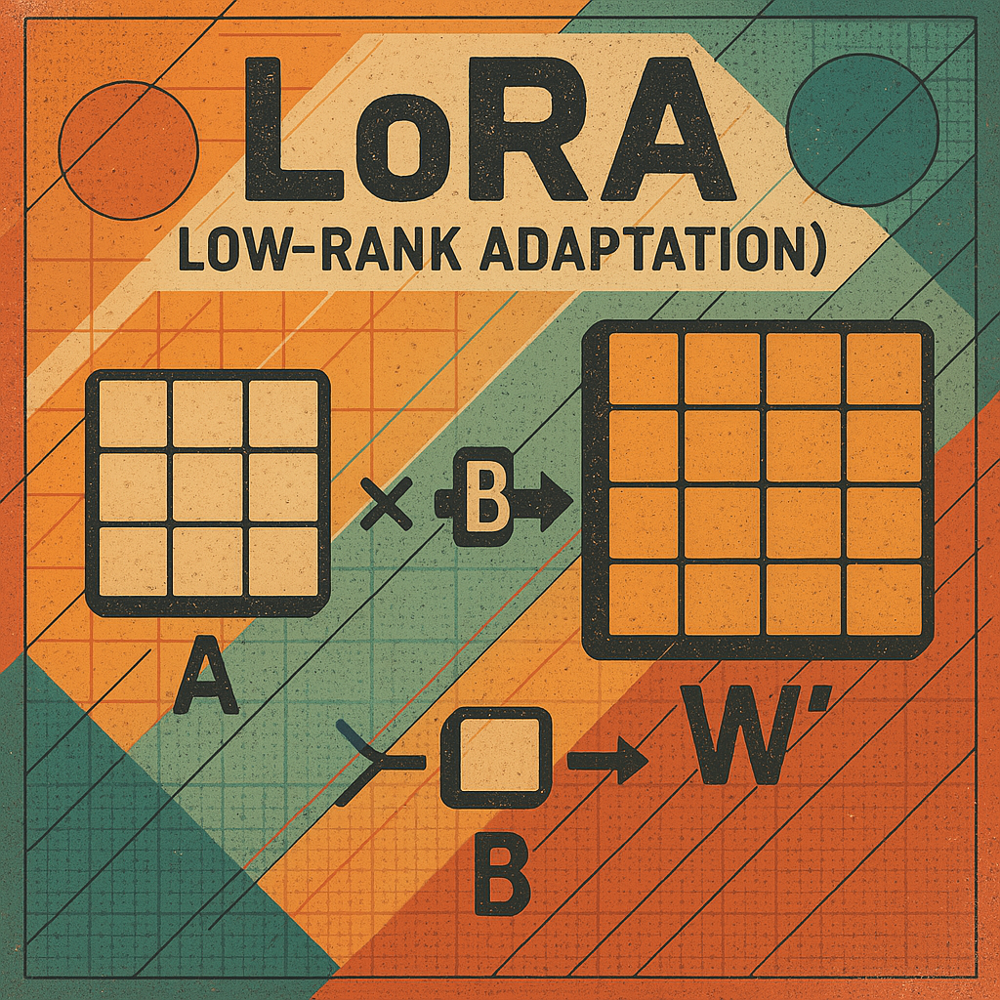

## LLMs কীভাবে কাজ করে

LLMs মডেলগুলি [বিশাল পরিমাণ ডেটা](https://commoncrawl.org/) থেকে ভাষার গঠন ও ব্যবহার শেখে। এগুলি [ট্রান্সফর্মার আর্কিটেকচারের](https://en.wikipedia.org/wiki/Transformer_(deep_learning_architecture)) উপর ভিত্তি করে তৈরি, যা শব্দগুলির মধ্যে সম্পর্ক বুঝতে সক্ষম। এই মডেলগুলি প্রথমে এই বিশাল সংখ্যক ডাটা দিয়ে pretrained হয় এবং তারপর নির্দিষ্ট কাজের জন্য ফাইন-টিউন করা হয়।​ [llama-3.1]((https://ai.meta.com/blog/meta-llama-3-1/) মডেল কে ১৫ trillion টোকেন দিয়ে train হয়েছে.

## ফাইন-টিউনিংয়ের চ্যালেঞ্জ

LLMs সাধারণত কয়েক বিলিয়ন প্যারামিটার নিয়ে গঠিত। এই বিশাল মডেলগুলিকে নির্দিষ্ট কাজে ফাইন-টিউন করতে প্রচুর কম্পিউটেশনাল রিসোর্স ও সময় লাগে। এছাড়া, পুরো মডেল ফাইন-টিউন করলে ওভারফিটিংয়ের ঝুঁকি থাকে. llama-3.1 মডেল এ ৪০৫ বিলিয়ন প্যারামিটার আছে. মডেল এ ৪০৫ বিলিয়ন প্যারামিটার আছে। এই মডেলের জন্য [ব্যাকপ্রপাগেশন](https://en.wikipedia.org/wiki/Backpropagation) করে সব প্যারামিটার আপডেট করা অনেক এক্সপেন্সিভ। এই সবগুলো পারমিটের ব্যবহার করে এই মডেল কে finetune করতে অনেক কম্পিউট পাওয়ার লাগবে।

এই সমস্যা কে সমাধান করার জন্য [PEFT](https://huggingface.co/docs/peft/en/index) নামে টেকনিক ব্যবহার করা হয়. এটি একটি প্রযুক্তি যা LLM মডেল গুলোকে তুলনামূলক কম রিসোর্স ব্যবহার করে নির্দিষ্ট কাজের জন্য টিউন করার একটি কৌশল

## PEFT কিভাবে কাজ করে

বড় মডেলগুলোর সব প্যারামিটার আপডেট করার বদলে, PEFT শুধুমাত্র কিছু নির্দিষ্ট অংশ বা অতিরিক্ত ছোট মডিউল আপডেট করে। এর ফলে:

- কম GPU মেমোরি লাগে
- কম সময় লাগে ট্রেনিংয়ে
- কম ডেটাও দরকার হয়

Most used way to for the PEFT is LoRa. Let see how LoRa works

## LoRA (Low-Rank Adaptation) কীভাবে সাহায্য করে

LoRA একটি প্যারামিটার এফিসিয়েন্ট ফাইন-টিউনিং পদ্ধতি, যা মূল মডেলের weights অপরিবর্তিত রেখে অতিরিক্ত ছোট লেয়ার যোগ করে মডেলকে নির্দিষ্ট কাজে অভিযোজিত করে। এতে কম মেমোরি ও কম্পিউটেশনাল রিসোর্স ব্যবহার করে মডেল ফাইন-টিউন করা যায়।​

মনে করে আপনার একটি ওয়েইট ম্যাট্রিক্স W আছে. LoRA মূল Weight ম্যাট্রিক্স W কে দুটি ছোট ম্যাট্রিক্স A এবং B দিয়ে প্রতিস্থাপন করে:​

$ W' = W + A \times B $

যেখানে,
- W: মূল Weight ম্যাট্রিক্স. এটা ফাইন-টিউনিং এর সময় ফ্রোজেন থাকে। অর্থাৎ এর কোনো ভেলু পরিবর্তন হয় না.
- A, B: ছোট ম্যাট্রিক্স, শুধুমাত্র এগুলোকেই প্রশিক্ষণ দেওয়া হয়. অর্থাৎ এর কোনো ভেলু পরিবর্তন হয়.

এই পদ্ধতিতে মূল মডেলের weight পরিবর্তন না করেই মডেলকে নির্দিষ্ট কাজে অভিযোজিত করা যায়।​

## LoRA-এর সুবিধা

- কম মেমোরি ব্যবহার: শুধুমাত্র ছোট ম্যাট্রিক্স A এবং B প্রশিক্ষিত হয়, ফলে মেমোরি ব্যবহার কম হয়।​
- দ্রুত প্রশিক্ষণ: কম প্যারামিটার প্রশিক্ষিত হওয়ায় সময় কম লাগে।​
- স্টোরেজ সাশ্রয়ী: প্রতিটি নির্দিষ্ট কাজের জন্য শুধুমাত্র LoRA লেয়ার সংরক্ষণ করতে হয়, পুরো মডেল নয়।​
- মডুলার ডিজাইন: বিভিন্ন কাজে বিভিন্ন LoRA লেয়ার ব্যবহার করে মূল মডেল অপরিবর্তিত রেখে কাজ করা যায়।

## LoRA (Low-Rank Adaptation) ম্যাট্রিক্স দিয়ে উদাহরণ সহ বোঝার চেষ্টা করি

ধরা যাক, আপনার কাছে একটি ওয়েট ম্যাট্রিক্স **W** আছে যার আকার $ m \times n $। পুরো ম্যাট্রিক্সটি fine-tune করতে হলে আপনাকে $ m \times n $ ম্যাট্রিক্স এর ভেলু আপডেট করতে হবে।

**W** আপডেট করার বদলে, LoRA দুটি ছোট ম্যাট্রিক্স প্রবর্তন করে:

- **A** যার আকার $ m \times r $
- **B** যার আকার $ r \times n $

এখানে **r** একটি ছোট সংখ্যা (Rank), যা সাধারণত **m** বা **n** থেকে অনেক ছোট হয়। তাই, পুরো ম্যাট্রিক্স **W** আপডেট না করে, আপনি শুধুমাত্র Low Rank ম্যাট্রিক্স **A** এবং **B** আপডেট করবেন।

আপনার ম্যাট্রিক্স যদি এই রকম হয়,

$
W = \begin{pmatrix}
1 & 2 & 3 \\
4 & 5 & 6 \\
7 & 8 & 9
\end{pmatrix}
$

### ধাপ ১: Low Rank অ্যাপ্রক্সিমেশন

ধরা যাক আমরা Rank **r = 2** নির্বাচন করেছি। আমরা দুটি ছোট ম্যাট্রিক্স **A** এবং **B** চিন্তা করি:

- ম্যাট্রিক্স **A** আকার $ 3 \times 2 $
- ম্যাট্রিক্স **B** আকার $ 2 \times 3 $

উদাহরণস্বরূপ, ধরুন:

$
A = \begin{pmatrix}
1 & 0 \\
0 & 1 \\
1 & 1
\end{pmatrix}
\quad
B = \begin{pmatrix}
1 & 2 & 3 \\
4 & 5 & 6
\end{pmatrix}
$

### ধাপ ২: **A** এবং **B** এর গুণফল হিসাব করা
এখন, আমরা **$A \times B$** এর গুণফল হিসাব করি:

$$
A \times B = \left[ \begin{array}{ccc}
1 & 0 \\
0 & 1 \\
1 & 1 \\
\end{array} \right]
\times
\left[ \begin{array}{ccc}
1 & 2 & 3 \\
4 & 5 & 6 \\
\end{array} \right]
=
\left[ \begin{array}{ccc}
1 & 2 & 3 \\
4 & 5 & 6 \\
5 & 7 & 9 \\
\end{array} \right]
$$

### ধাপ ৩: মূল ম্যাট্রিক্সটি W পরিবর্তন করা
এখন, পুরো মূল ম্যাট্রিক্স **W** আপডেট না করে, আপনি সংশোধিত ম্যাট্রিক্স ব্যবহার করবেন:

$
W' = W + A \times B
$

এখানে:
$$
W' = \left( \begin{array}{ccc}
1 & 2 & 3 \\
4 & 5 & 6 \\
7 & 8 & 9 \\
\end{array} \right)
+
\left( \begin{array}{ccc}
1 & 2 & 3 \\
4 & 5 & 6 \\
5 & 7 & 9 \\
\end{array} \right)
=
\left( \begin{array}{ccc}
2 & 4 & 6 \\
8 & 10 & 12 \\
12 & 15 & 18 \\
\end{array} \right)
$$

### ধাপ ৪: Low Rank ম্যাট্রিসের fine-tuning
Fine-tuning এর সময়, মূল **W** স্থির থাকে, এবং শুধুমাত্র **A** এবং **B** আপডেট করা হয়।

- এই ম্যাট্রিক্স **A** এবং **B** ছোট হওয়ায়, এগুলি আপডেট করতে কম মেমরি এবং কম্পিউটেশনাল শক্তি লাগে।
- অবশেষে, Updated ম্যাট্রিক্স **W'** ছোট Low Rank ম্যাট্রিক্স **A** এবং **B** থেকে তথ্য গ্রহণ করে, যা মডেলটিকে নতুন কাজের জন্য আরও কম প্যারামিটার দিয়ে অ্যাডাপ্ট করতে সহায়তা করে।

## সারাংশ:
- **W**: মূল ওয়েট ম্যাট্রিক্স (fine-tuning এর সময় স্থির থাকে)।
- **A** এবং **B**: Low Rank ম্যাট্রিক্স (ছোট এবং learnable অর্থাৎ এর কোনো ভেলু পরিবর্তন হয়)।
- **$W' = W + A \times B$**: সংশোধিত ওয়েট ম্যাট্রিক্স যা ফরওয়ার্ড পাসে অ্যাডাপ্টেশনের পর ব্যবহৃত হয়।

## Referances
- [Speech and Language Processing - PEFT](https://web.stanford.edu/~jurafsky/slp3/10.pdf)
- [Llama-3.1 - One of most capable opensource models](https://ai.meta.com/blog/meta-llama-3-1/)
- [Transformer](https://en.wikipedia.org/wiki/Transformer_(deep_learning_architecture))
- [CC Datasets](https://commoncrawl.org/)
- [PEFT](https://huggingface.co/docs/peft/en/index)
- [ব্যাকপ্রপাগেশন](https://en.wikipedia.org/wiki/Backpropagation)